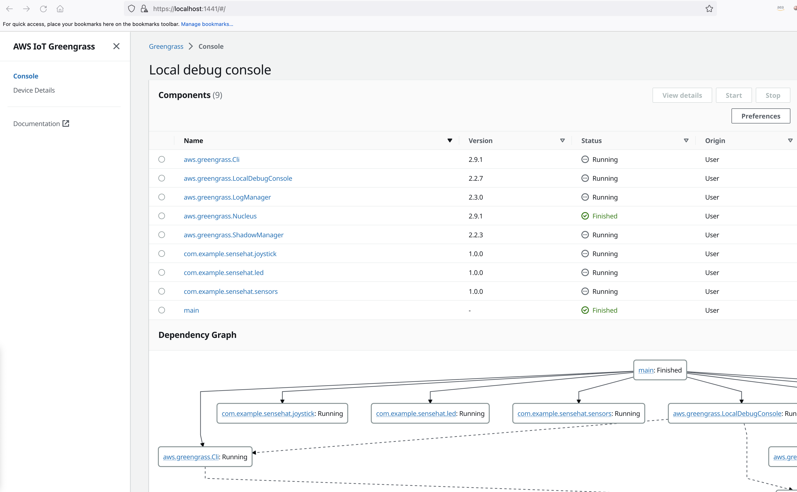

# AWS Greengrass JumpStart
This repo is a jumpstart demo of AWS greengrass. It has 2 customized components to demostrate 
- Local communication via IPC between components
- Device to cloud communication via MQTT
- Cloud to device communication via device shadow

### Architecture


### Device to Cloud Shadow Update 


### Cloud to Device Shadow Update 


# 1. Components overview
## 1.1 com.example.sensehat.sensors
This component send the sensors telemtries to IoT core. IoT Core topic and sending interval can be found in the [recipe](./Components/recipes/com.example.sensehat.sensors-1.0.0.json).

Example MQTT payload:
```json
{
  "timemillis": 1669671812573,
  "pitch": 314.27,
  "roll": 293.34,
  "yaw": 106.97,
  "temperature": 40.27,
  "pressure": 1026.98,
  "humidity": 28.74
}
```

## 1.2 com.example.sensehat.joystick
This component send the joystick events (move up/down/left/right, press/hold/release) to local IPC and AWS IoT Core. The IPC and IoT Core topic can be found in the [recipe](./Components/recipes/com.example.sensehat.joystick-1.0.0.json).

Example MQTT payload:
```json
{
  "timemillis": 1669202845134,
  "direction": "down",
  "action": "released"
}

{
  "timemillis": 1669202865267,
  "direction": "left",
  "action": "pressed"
}
```
The possible values of direction and action can be found at [Sense Hat Document](https://pythonhosted.org/sense-hat/api/#joystick).


## 1.3 com.example.sensehat.led
This component does the following:
- Maintain a number (0-9) and display it on LED
- When received joystick events via IPC
  - Joystick up/down: increse/decrese the number (range between 0-9)
  - Joystick left/right: change LED display to a random color
  - Joystick press down: toggle LED number display on/off
- Support IoT Core Shadow, so there are two ways to update the display number:
  - Use AWS IoT Core shadow to update the number remotely (cloud to device sync: every 10 seconds).
  - Use the joystick to update the number locally.

The IPC and IoTCore topic, shadown name etc can be found in the [recipe](./Components/recipes/com.example.sensehat.led-1.0.0.json).

**Note**: In this component we are using **GreengrassCoreIPCClientV2** (sensors and joystick are using v1), to avoid sync/async issue. With V2 the code is also cleaner. GreengrassCoreIPCClientV2 document can be found at [here](https://aws.github.io/aws-iot-device-sdk-python-v2/awsiot/greengrasscoreipc.html).

### 1.3.1 Special Note: When local and remote shadow can update the same setting 
The display number can be updated either by local joystick or by remote shadow in iot core. The latest update (either from local or remote) overwrites others. Therefore, it is important for local to set the "desired" value back to remote shadow in cloud, so the remote shadow knows the new "desired" value and will not update it in the next shadow sync cycle. 

See more at the document [evice-shadow-empty-fields](https://docs.aws.amazon.com/iot/latest/developerguide/device-shadow-document.html#device-shadow-empty-fields).

## 2. Setup your development environment 
### 2.1 Hardware
- Raspberry Pi 3b
- Raspberry Pi [Sense Hat](https://www.raspberrypi.com/products/sense-hat/)

## 2.2 Software
- Raspbery Pi OS (64 bit) 
- Sense Hat SDK 

If you are using the Pi OS lite version, remember to install needed packages
```bash
sudo apt update
sudo apt install python3-pip
sudo apt install git
sudo apt install sense-hat #need reboot
```

## 2.3 Install Greengrass software
Follow the steps in https://docs.aws.amazon.com/greengrass/v2/developerguide/getting-started.html

As a part of the installtion, create an IAM user with minimal permission (the role json can be found in [minimal-greengrass-policy-for-device.json](./PolicyDocuments/minimal-greengrass-policy-for-device.json)). You can deactive the key/secret after the device is provisioned.  

## 2.4 Deploy Greengrass components
- aws.greengrass.Cli
- aws.greengrass.ShadowManager ([config](./PolicyDocuments/shadow-manager-config.json))
- aws.greengrass.LocalDebugConsole 
- aws.greengrass.LogManager ([config](./PolicyDocuments/log-manager-config.json))

## 2.5 Develop your own components
### Setup development environment
1. Install VS Code with Remote SSH extension
2. In Remote SSH extension, enable ports forwarding for 1441 and 1442. Ensure it is set to HTTPS (not http by default). This is for access Greengrass LocalDebugConsole from your development laptop.

Check the development tips in the appendix

### 2.6 Setup shadow sync
1. Config the aws.greengrass.ShadowManager during deployment step. The sample config can be found at [shadow-manager-config.json](./PolicyDocuments/shadow-manager-config.json).
2. **Note**: Make sure the shadow name is correct in the "synchronize" section in the config, otherwise the shadow wont be sync between cloud and device. 
3. If your code calls UpdateShadow API but the shadow does not exist, the call will creat the shadow. If you try to GetShadow but it does not exist, you will get ResourceNotExist error. In that case, you can manually create the (named) shadow in IoT core console. (In this demo, the shadow "**NumberLEDNamedShadow**" will be created automatically, so you do not need to create it manually.)
4. For setting the shadow and sync to device, edit the default shadow document, in "desired" section, add the needed field: (you can skip the "reported" section)
```json
{
  "state": {
    "desired": {
      "number":9
    }
  }
}
```
5. More details can be found in the [sync-shadows-with-iot-core](https://docs.aws.amazon.com/greengrass/v2/developerguide/sync-shadows-with-iot-core.html) and [ipc-local-shadows](https://docs.aws.amazon.com/greengrass/v2/developerguide/ipc-local-shadows.html).

## Appendix
### Useful commands
You can run in on Pi via VS Code remote SSH terminal. For deployment, 

#### Deploy a component
```bash
# ensure your terminal is at the root of this repo, that has folder Components
sudo /greengrass/v2/bin/greengrass-cli deployment create --recipeDir Components/recipes --artifactDir Components/artifacts --merge "com.example.sensehat.led=1.0.0"
```

#### Remove a component
```bash
sudo /greengrass/v2/bin/greengrass-cli --ggcRootPath /greengrass/v2 deployment create --remove "com.example.sensehat.led"
```

#### List components
```bash
sudo /greengrass/v2/bin/greengrass-cli component list
```

#### Check logs for troubleshooting
The log file structure is at https://docs.aws.amazon.com/greengrass/v2/developerguide/monitor-logs.html
```bash
#greengrass system logs
sudo tail /greengrass/v2/logs/greengrass.log

# log of a componnet
sudo cat /greengrass/v2/logs/com.example.sensehat.joystick.log
```

With aws.greengrass.LogManager, you can also directly check cloudwatch. The log group is something like "/aws/greengrass/UserComponent/eu-west-1/com.example.sensehat.led"


#### Use local debug console
After you deployed the aws.greengrass.LocalDebugConsole component and enabled 1441 and 1442 port forwarding, you can access the console https://localhost:1441/ from you local laptop

1. Get access password (user name is "debug")
```bash
sudo /greengrass/v2/bin/greengrass-cli get-debug-password
```

2. The console is using a self-signed https certificate, use firefox to bypass the warning (Edge cannot bypass)



#### Access local hardware resources
By default the Greengrass user cannot have permission to access local hardware resources such as sense hat. There are two ways to solve it:
1. In recipes, require RequiresPrivilege (recommended)
```json
"RequiresPrivilege": true
```
2. Manually add greengrass user to linux usergroups
```bash
# error msg from logs
# 2022-10-22T20:16:51.747Z [WARN] (Copier) linkcd.sensehat.HelloWorld: stderr. PermissionError: [Errno 13] Permission denied: '/dev/input/event1'.

# the user in the "input" group can acess /dev/input/event1
$ ls -l /dev/input/event1
# crw-rw---- 1 root input 13, 65 Sep 22 04:17 /dev/input/event1

# ggc_user is not in that group
$ groups ggc_user
# ggc_user : ggc_user ggc_group

# add ggc_user to "input" group
$ sudo addgroup ggc_user input
# Adding user `ggc_user' to group `input' ...
# Adding user ggc_user to group input
# Done.

#another error 
# HelloWorld: stderr. PermissionError: [Errno 13] Permission denied: '/dev/fb0'. {scriptName=services.linkcd.sensehat.HelloWorld.lifecycle.Run, serviceName=linkcd.sensehat.HelloWorld, currentState=RUNNING}

# the user in "video" group can access /dev/fb0
$ ls -l /dev/fb0
# crw-rw---- 1 root video 29, 0 Sep 22 04:17 /dev/fb0

# add gcc_user to 
$ sudo addgroup ggc_user video
# Adding user `ggc_user' to group `video' ...
# Adding user ggc_user to group video
# Done.
```

#### More tips/references:
1. [Greengrass workshop](https://catalog.us-east-1.prod.workshops.aws/workshops/5ecc2416-f956-4273-b729-d0d30556013f/en-US)
2. [Tips/troubleshooting from the workshop](https://catalog.us-east-1.prod.workshops.aws/workshops/5ecc2416-f956-4273-b729-d0d30556013f/en-US/chapter13-tips-troubleshoot)
3. [AWS IoT Youtube channel](https://www.youtube.com/c/AWSIoTChannel)
4. [AWSomeIoT Youtube channel](https://www.youtube.com/@awsomeiot1448)
5. [AWS Greengrass tutorials](https://docs.aws.amazon.com/greengrass/v2/developerguide/what-is-iot-greengrass.html)